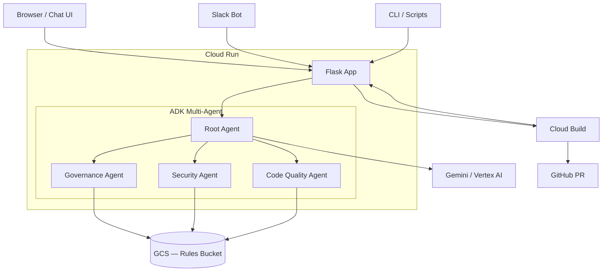

# Governance Agent

## Overview

The Governance Agent is a multi-agent system built with [Google ADK](https://google.github.io/adk-docs/) (Agent Developer Kit) that automatically reviews pull requests and answers governance questions across three domains: **compliance/PR standards**, **security**, and **code quality**. It exposes a Flask API deployed on Cloud Run, integrates with GitHub via Cloud Build to gate PRs, and provides a chat UI for interactive queries. Rules are stored as Markdown files in GCS, making them editable without redeploying.

## Architecture



## Prerequisites

- [`gcloud` CLI](https://cloud.google.com/sdk/docs/install) authenticated (`gcloud auth login`)
- Python 3.11+
- Docker (for local image build/test)
- A GCP project with billing enabled
- A Gemini API key — for local development (`GOOGLE_GENAI_USE_VERTEXAI=0`)
  **OR** Vertex AI access — for Cloud Run (no key needed; the service account handles auth)

## Quick Start (Local)

```bash
# 1. Clone the repo
git clone <repo-url>
cd code-review-agent-adk

# 2. Create and activate a virtual environment
python3 -m venv .venv
source .venv/bin/activate

# 3. Install dependencies
pip install -r requirements.txt

# 4. Configure environment variables
cp .env.example .env
# Edit .env and set:
#   GOOGLE_API_KEY=your-gemini-api-key
#   LOCAL_RULES_DIR=rules/

# 5. Run the server
python -m governance_agent.app
```

The server starts on `http://localhost:8080`.

**Chat UI:** open `http://localhost:8080` in your browser.

**API examples:**

```bash
# Health check
curl http://localhost:8080/health

# Ask a governance question
curl -X POST http://localhost:8080/query \
  -H "Content-Type: application/json" \
  -d '{"input": "What are the naming convention rules?"}'

# Review a PR diff
curl -X POST http://localhost:8080/review \
  -H "Content-Type: application/json" \
  -d '{"diff": "+password = \"abc123\""}'
```

## Running Tests

```bash
python -m pytest tests/ -v
```

| Test file | What it covers |
|---|---|
| `tests/test_agent.py` | Verifies the ADK agent structure: root agent name, sub-agent registration, tool binding per sub-agent, and that all agents use the same model. |
| `tests/test_api.py` | Flask endpoint tests: `/health` 200 response, validation of empty `input`/`diff`, successful query and review flows (mocked agent), JSON parsing of the review response, and the fallback for non-JSON agent responses. |
| `tests/test_tools.py` | GCS reader unit tests: local file reading for each domain, missing-directory error handling, GCS path invocation when `RULES_BUCKET` is set, and correct prefix passed by each domain function (`load_governance_rules`, `load_security_rules`, `load_code_quality_rules`). |

## Deploying to GCP

### Prerequisites

```bash
gcloud auth login
gcloud config set project YOUR_PROJECT_ID
```

### Run the setup script

```bash
# Edit setup.sh and fill in PROJECT_ID and GITHUB_PAT at the top
bash setup.sh
```

The script will:
1. Enable all required GCP APIs
2. Create an Artifact Registry Docker repository
3. Create a Cloud Run service account with the required IAM roles
4. Create the GCS rules bucket and upload all rules
5. Store the GitHub PAT in Secret Manager
6. Build and push the Docker image via Cloud Build
7. Deploy the service to Cloud Run
8. Print the Cloud Run URL

### Note the Cloud Run URL

At the end of the script, the URL is printed. Use it as `_AGENT_URL` in the Cloud Build trigger (see below).

## Cloud Build Trigger (Manual Setup)

The GitHub connection must be created through the GCP Console UI — it cannot be done via CLI without an existing connection. Follow these steps:

1. Open [Cloud Build Triggers](https://console.cloud.google.com/cloud-build/triggers) in the GCP Console.
2. Click **Connect Repository**, choose **GitHub**, and authorize GCP.
3. Select your repository.
4. Click **Create Trigger** and configure:
   - **Event:** Pull Request
   - **Source:** your repository, branch `^main$` (or your base branch)
   - **Configuration:** Cloud Build configuration file → `cloudbuild.yaml`
   - **Substitution variables:**

     | Variable | Value |
     |---|---|
     | `_AGENT_URL` | Cloud Run URL from `setup.sh` (no trailing slash) |
     | `_GITHUB_REPO` | `org/repo` (e.g. `acme/my-service`) |
     | `_PR_NUMBER` | Leave empty — Cloud Build fills this at runtime |
     | `_BASE_BRANCH` | `main` (or your default branch) |

5. Save the trigger.

Every new PR will now trigger a governance review. The build passes (`exit 0`) if the agent approves, and fails (`exit 1`) if violations are found. The agent's feedback is posted as a comment on the PR.

## Adding Rules

Rules are Markdown files read by the agent at runtime. To add or update rules without redeploying:

```bash
# Upload a new rule file to the relevant domain folder
gcloud storage cp my-new-rule.md gs://governance-rules-YOUR_PROJECT/governance/

# Available domain prefixes:
#   governance/      → compliance, PR standards, branching
#   security/        → secrets, OWASP, API security
#   code-quality/    → naming, error handling, testing
```

The agent reads all `.md` files in the folder on every request — no restart needed.

For **local development**, place the file in the corresponding `rules/<domain>/` directory and ensure `LOCAL_RULES_DIR=rules/` is set in `.env`.

## Extending with New Domains

To add a new governance domain (e.g., `performance`):

1. **Create a sub-agent** at `governance_agent/sub_agents/performance.py`, following the pattern in `security.py` or `code_quality.py`.
2. **Create a tool** in `governance_agent/tools/gcs_reader.py`: add a `load_performance_rules()` function that calls `_load_rules("performance/")`.
3. **Register the sub-agent** in `governance_agent/agent.py`: import it and add it to `root_agent`'s `sub_agents` list.
4. **Upload rules** to `gs://governance-rules-YOUR_PROJECT/performance/` (and add local files to `rules/performance/` for dev).

## API Reference

| Endpoint | Method | Request body | Response body |
|---|---|---|---|
| `/health` | GET | — | `{"status": "ok"}` |
| `/query` | POST | `{"input": "string", "context": {}}` | `{"response": "string"}` |
| `/review` | POST | `{"diff": "string"}` | `{"approved": bool, "violations": ["..."], "recommendation": "string", "feedback_md": "string"}` |

**`/query`** accepts an optional `context` object (arbitrary key/value pairs) that is appended to the prompt as JSON.

**`/review`** returns `approved: false` and a `raw_response` field (instead of structured fields) when the agent's response cannot be parsed as JSON.

## Environment Variables Reference

| Variable | Purpose | Required | Local value | Cloud Run value |
|---|---|---|---|---|
| `GOOGLE_GENAI_USE_VERTEXAI` | `0` = Gemini API key, `1` = Vertex AI | Yes | `0` | `1` |
| `GOOGLE_API_KEY` | Gemini API key (only when `VERTEXAI=0`) | Local only | Your key | — |
| `GOOGLE_CLOUD_PROJECT` | GCP project ID (Vertex AI) | Prod only | — | Your project ID |
| `GOOGLE_CLOUD_LOCATION` | GCP region for Vertex AI | Prod only | — | `us-central1` |
| `LOCAL_RULES_DIR` | Path to local rules directory | Local only | `rules/` | — |
| `RULES_BUCKET` | GCS bucket name for rules | Prod only | — | `governance-rules-PROJECT_ID` |
| `PORT` | HTTP port for Flask | No | `8080` | Set by Cloud Run |

Copy `.env.example` to `.env` and fill in the local values. **Never commit `.env`.**

## Verification

### Local

```bash
curl http://localhost:8080/health

curl -X POST http://localhost:8080/query \
  -H "Content-Type: application/json" \
  -d '{"input": "What are the naming convention rules?"}'

curl -X POST http://localhost:8080/review \
  -H "Content-Type: application/json" \
  -d '{"diff": "+password = \"abc123\""}'
```

### Cloud Run

Replace `http://localhost:8080` with the Cloud Run URL. For authenticated services, add the identity token header:

```bash
curl -H "Authorization: Bearer $(gcloud auth print-identity-token)" \
  https://YOUR_SERVICE_URL/health
```

> **Note:** `setup.sh` deploys with `--allow-unauthenticated` so the chat UI is publicly accessible. For production, remove that flag and add IAP or another auth layer.

### Tests

```bash
python -m pytest tests/ -v
```
